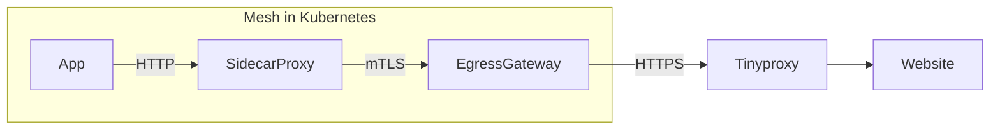

# Kubernetes manifests for TLS origination through an egress gateway through a tinyproxy

These manifests are only a proof a concept. Care must be taken.

The tinyproxy is installed inside kubernetes, but can be configured outside.

Works with istio control plane 1.15.3, installed with `istioctl install --set profile=minimal`

Thanks a lot to https://gist.github.com/cortex93/6d7cd9738b077d0447ab891cbacd0d5e making the envoyfilter manifest possible.

Egressgateways manifests are taken from https://github.com/GoogleCloudPlatform/anthos-service-mesh-packages/tree/main/samples/gateways/istio-egressgateway

TLS Originating manifests are taken from https://istio.io/latest/docs/tasks/traffic-management/egress/egress-gateway-tls-origination/

